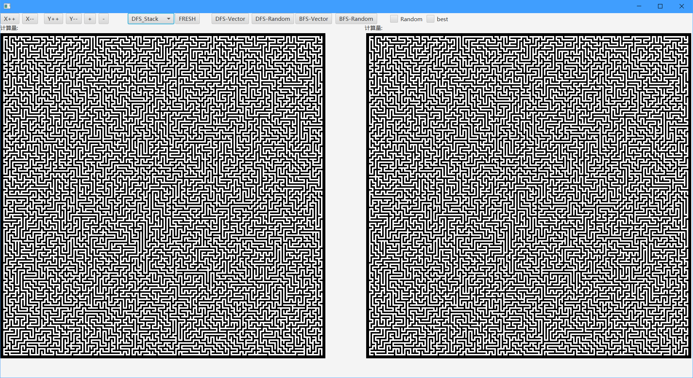
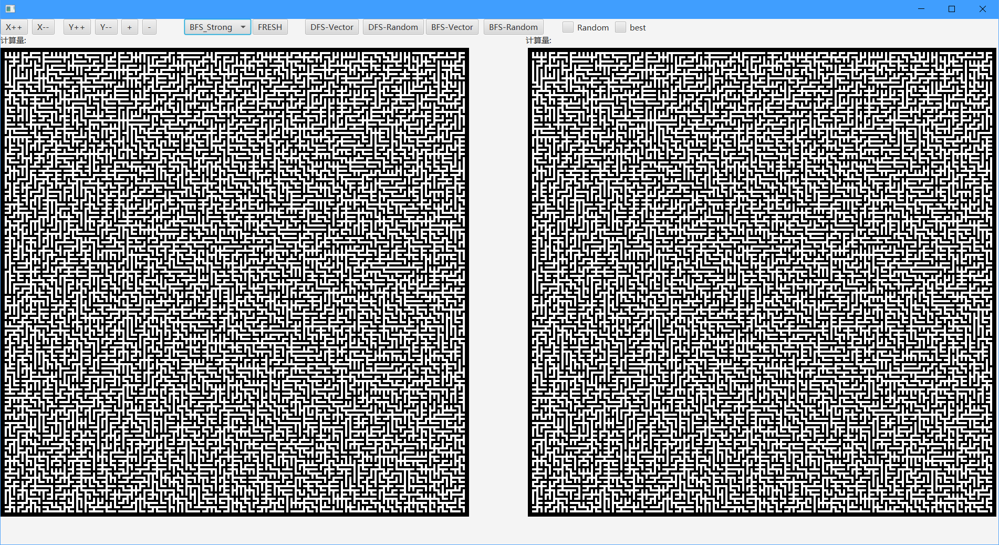
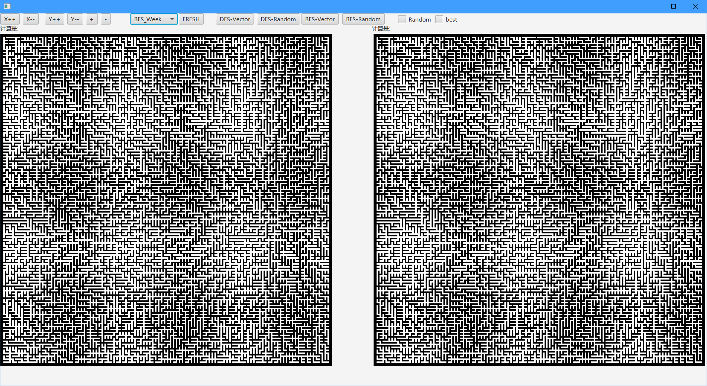
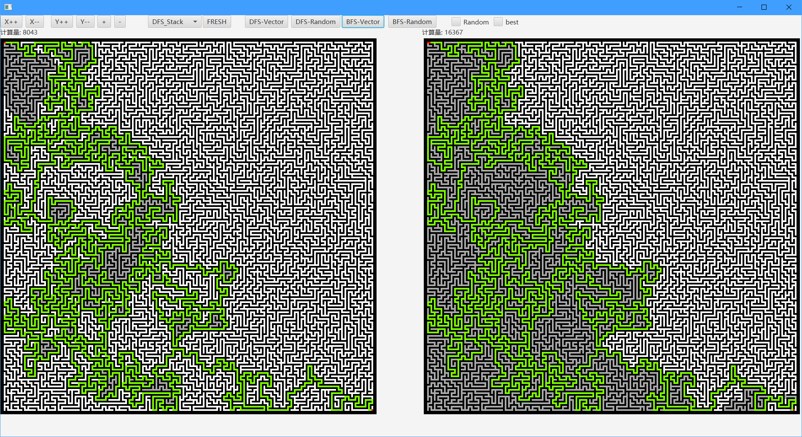
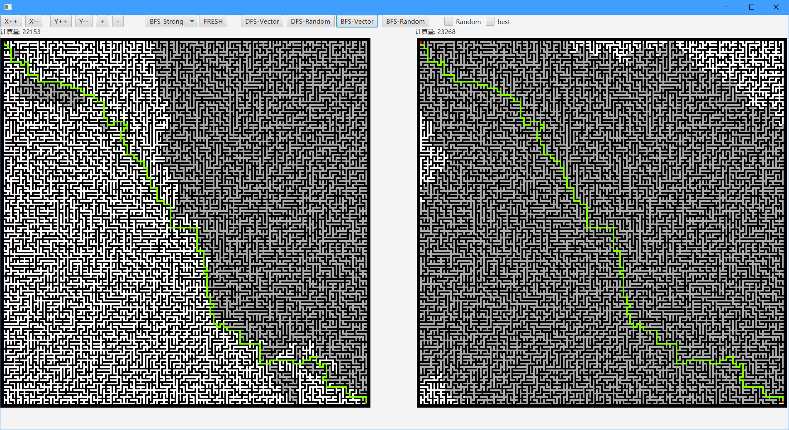

# 迷宫可视化  
## 项目简介  
大一下学期（19年中旬）java期末的课程设计，使用javafx进行可视化。  
存档留念。  
## 效果展示  
+ 使用DFS生成迷宫：  
  
+ 使用BFS生成迷宫(法一)：  
  
+ 使用BFS生成迷宫(法二)：  
  
+ 分别利用DFS和BFS遍历DFS生成的迷宫：  
  
+ 分别利用DFS和BFS便利BFS生成的迷宫：  
  
## 声明  
该项目为本人早期编写，💩山一个，不具有维护价值，仅做留念。  